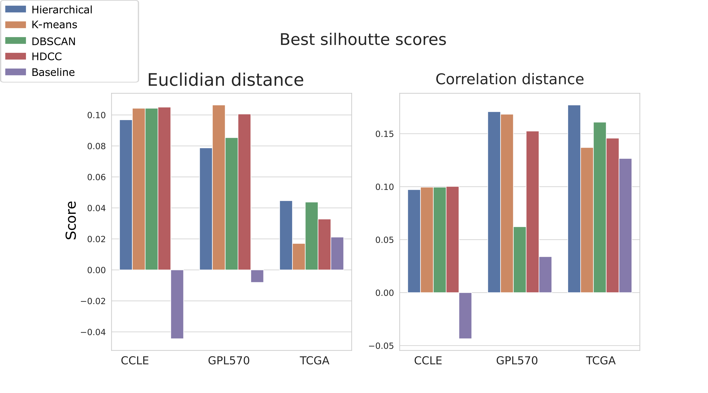

<!-- PROJECT LOGO -->
<br />
<p align="center">
  

  <h3 align="center">Divide and conquer</h3>


<!-- TABLE OF CONTENTS -->
<details open="open">
  <summary><h2 style="display: inline-block">Table of Contents</h2></summary>
  <ol>
    <li>
      <a href="#about-the-project">About The Project</a>
      <ul>
        <li><a href="#built-with">Built With</a></li>
      </ul>
    </li>
    <li>
      <a href="#getting-started">Getting Started</a>
      <ul>	
        <li><a href="#prerequisites">Prerequisites</a></li>
        <li><a href="#installation">Installation</a></li>
      </ul>
    </li>
    <li><a href="#usage">Usage</a></li>
    <li><a href="#license">License</a></li>
    <li><a href="#images">Images</a></li>
  </ol>
</details>


<!-- ABOUT THE PROJECT -->
## About The Project
Cancer has a huge impact on our society, with 608.570 cancer deaths estimated to occur in the USA in 2021. Currently to understand the complex mixture of signals present in cancer an independent component analysis (ICA) is used. However, in large datasets, ICA needs to drop a percentage of variance in the data to make it computationally feasible. Our results indicate that this dropped information contains critical information about rare cancer types. In this paper, we show that a divide and conquer approach to ICA is capable of finding transcriptomic footprints that were otherwise missed. Specifically, we highlight a transcriptomic footprint related to mantle cell lymphoma that was only discovered using a divide and conquer strategy.  Our divide and conquer algorithm depends on using high dimensional clustering (HDDC) to make separate subsets of the data to which ICA is performed individually. We used high dimensional data clustering because it showed a good silhouette score combined with easy-to-understand cluster decisions. Furthermore, results show that dividing the data with HDDC outperforms dividing randomly. We anticipate our paper to be the starting point in developing a sophisticated divide and conquer approach capable of finding every possible biological pathway present among cancer samples.


This Github page is about the first part of the project, the clustering. High dimensional data clustering (HDDC), mini batch K-means, Hiearchical clustering and UMAP+HDBSCAN are gridsearched and tested on three different datasets. The datasets are the GPL570, CCLE, and TCGA datasets. 


### Built With

* Python 3.9.6
* R 3.6.1


<!-- GETTING STARTED -->
## Getting Started

The scripts can't be run without access to the Peregrine cluster of the RUG. On this server the datasets are stored and access needs to be provided on request. The datasets are available as public repositories and can be found the following way:

For the GEO platform, healthy and cancer samples were selected. These samples were selected with a two-step approach. First, automatic keyword filtering was applied. In this approach, the simple omnibus format in text (SOFT) was scanned. SOFT files contain metadata for each sample, this includes experimental condition and patient information. In this search approach only samples were kept if certain keywords can be matched with the descriptive field in the SOFT file. These keywords were chosen very broadly like 'breast' or 'lung'. Because of this broad approach a manual check was needed to remove false positives. In this step, only samples were kept if raw data was available and the samples represented a healthy or cancer tissue of patients. Cell lines, cultured human biopsies, and animal-derived tissue were excluded in this step. 

For the TCGA the data was obtained from 34 cancer datasets available at the Broad GDAC Fire hose portal https://gdac.broadinstitute.org/. Here gene normalized RNA-sequence data was downloaded. Fragments per kilo-base of transcript per million mapped reads upper quartile normalization https://docs.gdc.cancer.gov/Data/PDF/Data_UG.pdf was used to normalize RNA-Seq expression level read counts.

The CCLE dataset contains raw mRNA data of human cell lines. The following research conducted a detailed genetic characterization of these cell lines (The Cancer Cell Line Encyclopedia enables predictive modelling of anticancer drug sensitivity, Barretina) 

### Prerequisites
Jupiter notebook, Python and R should be installed and working before the main script can be used. 

### Installation

1. Clone the repo
   ```sh
   git clone https://github.com/MarkF-hanze/UMCG_Thesis
   ```
2. Install the required python packages
   ```sh
   pip3 install -r requirements_python.txt
   ```
3. Install the R enviorement. Download requirements_R.yml and run in parent directory
   ```sh
      conda env create
   ```
  


<!-- USAGE EXAMPLES -->
## Usage
- Bash_Runs/      Contains scripts to run in the cluster.
  * Jobs: contains the to be run files.
  * Outputs: contains the output results of these runs
- Scripts/Gridsearch Contains scripts to run the gridsearch
  * Main: Search the best parameters for K-means and UMAP+HDBSCAN algorithm
  * HDDC: give parameters (filepath) (clusternumber) search for the best HDDC parameters for this number of cluster for this dataset
  * TestTimeR: Temporary file to test how long the HDDC algorithm will run on the comple GPL570 dataset to see if it is computationally feasible
  * make_scores: Functions to calculate the silhouette score for a given dataset with labels
- JupyterNotebook: This file contains notebooks that were used to further analyise some of the results
- Results: Contains all the resulting images from all the analysis. Contains the best parameters and other results for every dataset and every algorithm. Also contains *dashboard.html* files. These files contain some manual evaluation results for how each clustering algorithm clusters the cancer type. Also the algorithms clustering behaviour is further analysed with the help of a sankey plot.


<!-- LICENSE -->
## License

Distributed under the mozilla license. See `LICENSE` for more information.

<!-- IMAGES -->
## Images
 ### End results comparison algorithms
   


